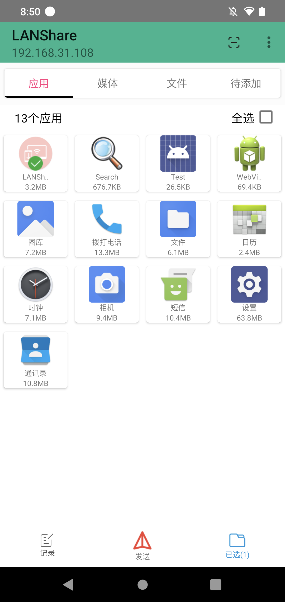
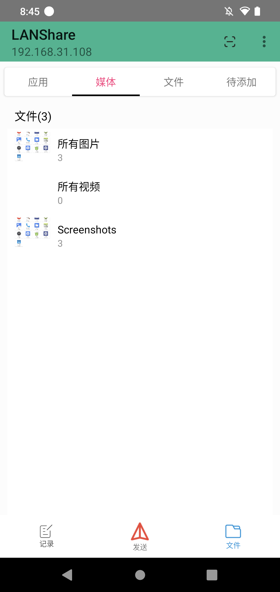
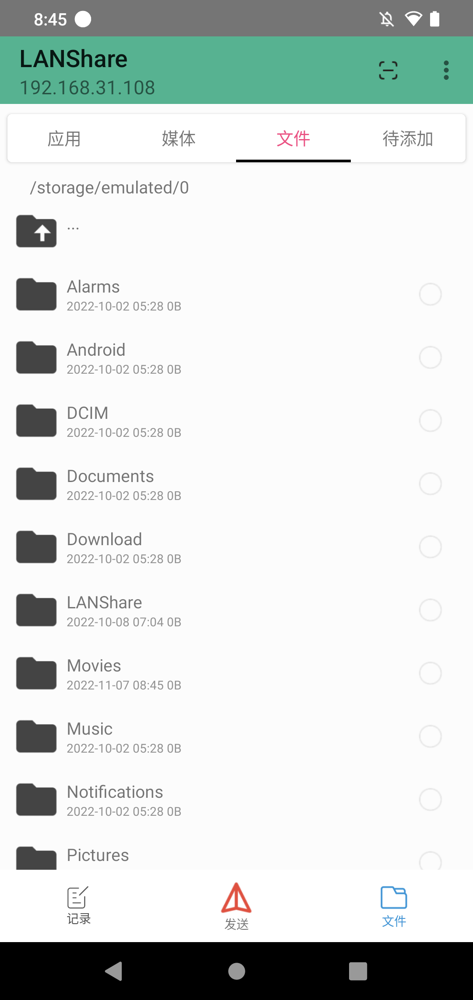
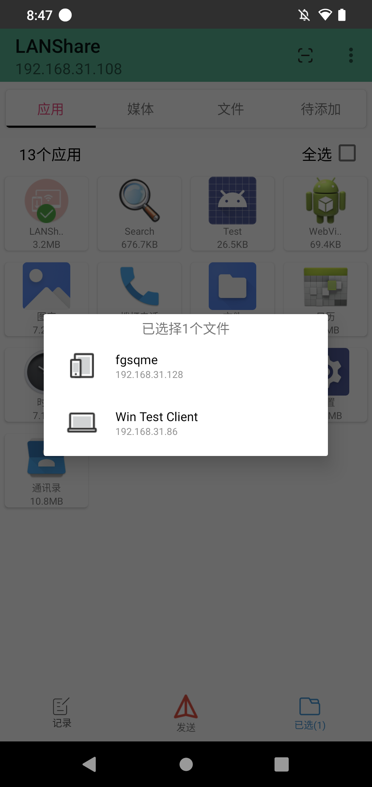
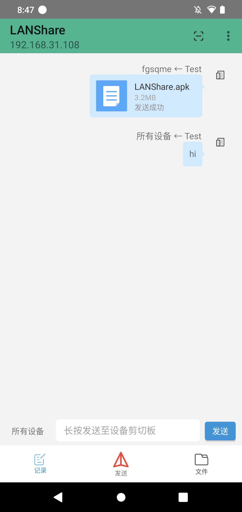

# LANShare(局域网文件传输工具)

LANShare是一款局域网文件传输工具，在同一局域网内可以实现相互文件传输消息发送，自带媒体浏览、APP浏览以及文件浏览功能，
可快捷选择文件进行发送。自动搜索，无需再进行手动搜索

### 效果图

- 应用选择
     
  
- 媒体选择
     
  
- 文件选择
     
  
- 选择设备发送
     
  
- 文件传输
     
  

## 原理

1. 通过UDP广播实现设备搜索和消息发送
2. TCP协议用来传输文件或者传输长文本

## issue

QQ群:538809905

## windows端(开发中)

LANShare-win [LANShare-win](https://github.com/fgsqme/LANShare-win)

## License

    Copyright 2021 fgsqme

    Licensed under the Apache License, Version 2.0 (the "License");
    you may not use this file except in compliance with the License.
    You may obtain a copy of the License at

        http://www.apache.org/licenses/LICENSE-2.0

    Unless required by applicable law or agreed to in writing, software
    distributed under the License is distributed on an "AS IS" BASIS,
    WITHOUT WARRANTIES OR CONDITIONS OF ANY KIND, either express or implied.
    See the License for the specific language governing permissions and
    limitations under the License.
