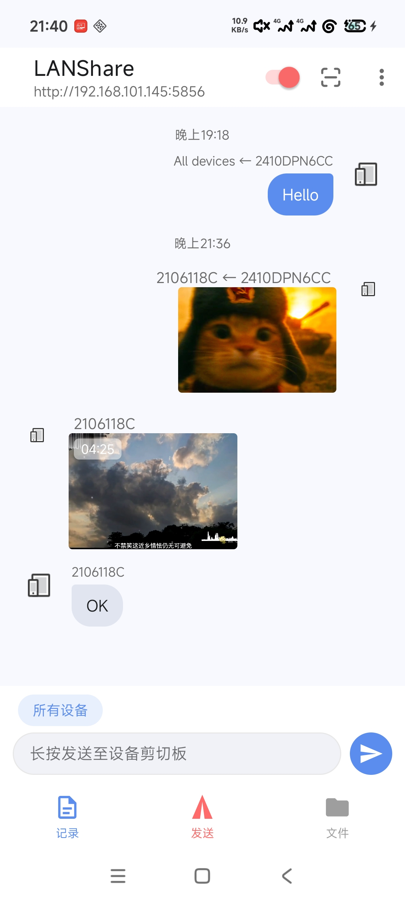
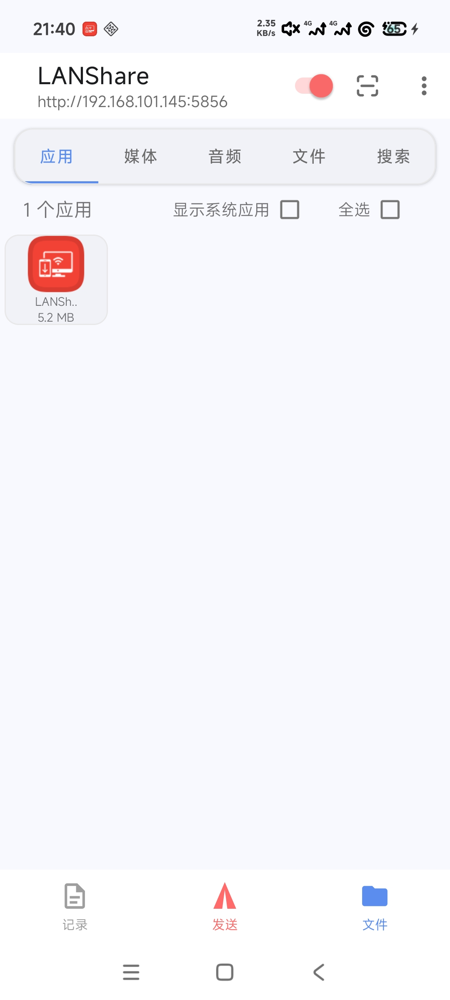
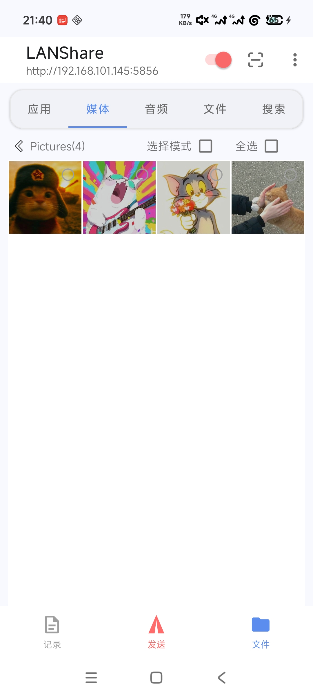
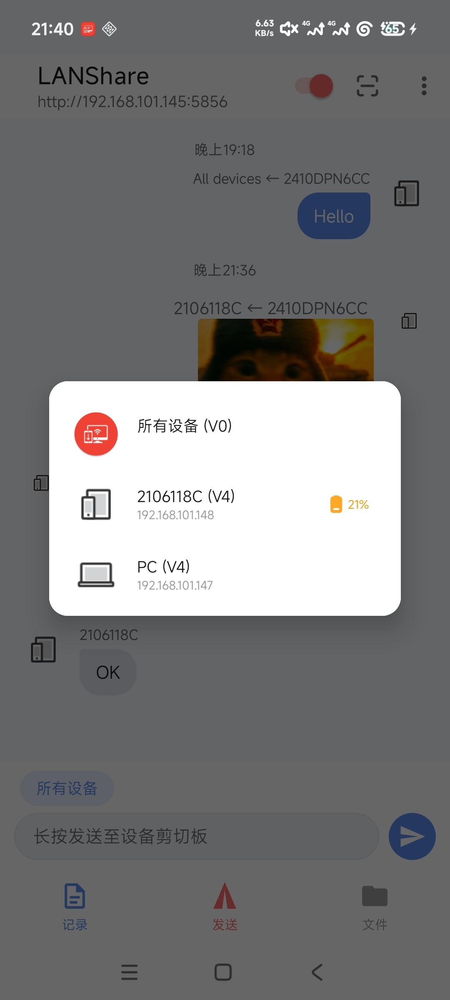
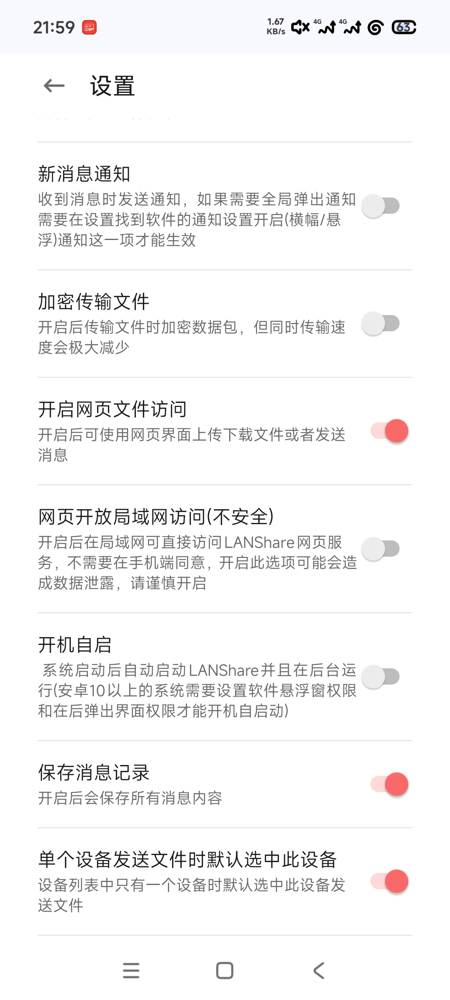

# LANShare — 局域网文件传输工具

[](LICENSE)
[]()
[]()

LANShare 是一款运行在 Android 平台上的局域网文件传输工具。只需处于同一局域网内，即可自动发现设备并实现文件、消息、媒体等内容的快速互传，无需手动输入 IP 地址，操作简洁、上手即用。

---

## 功能特性

- **自动设备发现** — 基于 UDP 广播，自动搜索同一局域网内的设备，无需手动配置
- **文件传输** — 基于 TCP 协议，支持各类文件的快速传输
- **消息发送** — 支持设备间文本消息的实时发送
- **文件浏览** — 内置文件浏览器，快捷选择文件进行发送
- **媒体浏览** — 内置图片、视频、音频等媒体文件浏览功能
- **APP 浏览与分享** — 查看已安装应用列表，快速分享 APK 文件
- **Web 文件服务** — 内置 HTTP 文件服务器，支持通过浏览器访问和传输文件
- **文件同步** — 支持设备间的文件同步功能
- **二维码扫描** — 集成 ZXing 扫码功能，支持扫码添加设备
- **暗黑模式** — 支持深色/浅色主题切换
- **开机自启** — 支持开机自动启动后台服务
- **外部共享** — 支持通过系统分享菜单直接发送文件到 LANShare
- **AES 加密** — 传输消息采用 AES 加密，保障数据安全
- **文件分类保存** — 接收文件按类型自动分类存储
- **远程绘图** — 支持设备间实时双向绘图同步（基于 V4 协议 TCP 长连接），同时支持通过网页端 WebSocket 与 APP 同步绘图，可自定义颜色、画笔粗细，坐标归一化适配不同屏幕尺寸

## 效果图

| 应用选择 | 媒体选择 | 文件选择 | 选择设备发送 | 文件传输 |
|:---:|:---:|:---:|:---:|:---:|
|  |  |  |  |  |

## 技术原理

| 功能 | 协议/技术 |
|---|---|
| 设备发现 | UDP 广播 |
| 文件/长文本传输 | TCP 协议 |
| 消息加密 | AES 加密 |
| Web 文件服务 | HTTP（内置 HttpServer） |
| 远程绘图 | TCP（V4 协议）+ WebSocket |
| 二维码 | ZXing |
| 日志 | SLF4J + Logback |

## 技术栈

- **语言**：Java
- **最低支持版本**：Android 4.4.2（API 14）
- **目标编译版本**：Android 13（API 33）
- **构建工具**：Gradle + Android Gradle Plugin 7.0.4
- **架构**：多模块（`:app` 主应用 + `:mnvideoplayerlibrary` 视频播放库）

### 主要依赖

| 库 | 用途 |
|---|---|
| AndroidX (RecyclerView, AppCompat, Material) | UI 组件 |
| Glide | 图片加载 |
| PhotoView | 图片预览 |
| ZXing | 二维码扫描 |
| FastJSON | JSON 解析 |
| XXPermissions | 权限申请 |
| SLF4J + Logback | 日志框架 |
| Commons Codec | 工具库 |
| HttpServer | HTTP 文件服务器（[fgsq-team/HttpServer](https://github.com/fgsq-team/HttpServer)） |

## 项目结构

```
LANShare/
├── app/                          # 主应用模块
│   ├── src/main/
│   │   ├── java/com/fgsqw/lanshare/
│   │   │   ├── activity/         # Activity 层（主界面、设置、预览等）
│   │   │   ├── base/             # 基类（BaseActivity, BaseFragment 等）
│   │   │   ├── config/           # 全局配置
│   │   │   ├── constants/        # 常量定义（命令码等）
│   │   │   ├── db/               # 数据库操作
│   │   │   ├── dialog/           # 自定义弹窗
│   │   │   ├── fragment/         # Fragment（聊天、文件列表等）
│   │   │   ├── listener/         # 监听器
│   │   │   ├── pojo/             # 数据模型
│   │   │   ├── receiver/         # 广播接收器
│   │   │   ├── service/          # 后台服务（LAN 服务、音乐服务）
│   │   │   ├── utils/            # 工具类
│   │   │   ├── web/              # Web 文件服务器
│   │   │   └── widget/           # 自定义控件
│   │   ├── assets/web/           # Web 前端资源
│   │   └── res/                  # 资源文件
│   └── libs/                     # 本地 JAR 依赖
├── mnvideoplayerlibrary/         # 视频播放库模块
└── build.gradle                  # 根构建配置
```

## 构建

```bash
# 克隆项目
git clone https://github.com/fgsq-team/LANShare.git

# 进入项目目录
cd LANShare

# 构建 Debug 版本
./gradlew assembleDebug

# 构建 Release 版本
./gradlew assembleRelease
```

## 配置说明

| 配置项 | 默认值 | 说明 |
|---|---|---|
| UDP 端口 | 4573 | 设备发现广播端口 |
| TCP 端口 | 5856 | 文件传输服务端口 |
| 文件保存路径 | `/LANShare/` | 接收文件的默认存储路径 |
| 扫描间隔 | 5 秒 | 局域网设备扫描时间间隔 |

## 相关项目

- **HttpServer**：内置 HTTP 文件服务器 — [fgsq-team/HttpServer](https://github.com/fgsq-team/HttpServer)
- **LANShare-PC**：桌面端（Win / Mac / Linux）— [fgsq-team/LANShare-PC](https://github.com/fgsq-team/LANShare-PC)
- **LANShare-Harmony**：鸿蒙版（开发中）— [fgsq-team/LANShare-Harmony](https://github.com/fgsq-team/LANShare-Harmony)

## 问题反馈

如有问题或建议，欢迎通过以下方式联系：

- QQ 群：538809905
- [GitHub Issues](https://github.com/fgsq-team/LANShare/issues)

## 赞助支持

如果 LANShare 对你有帮助，欢迎请作者喝杯咖啡 ☕

| 微信 | 支付宝 |
|:---:|:---:|
|  |  |

## License

```
Copyright 2021 fgsqme

Licensed under the Apache License, Version 2.0 (the "License");
you may not use this file except in compliance with the License.
You may obtain a copy of the License at

    http://www.apache.org/licenses/LICENSE-2.0

Unless required by applicable law or agreed to in writing, software
distributed under the License is distributed on an "AS IS" BASIS,
WITHOUT WARRANTIES OR CONDITIONS OF ANY KIND, either express or implied.
See the License for the specific language governing permissions and
limitations under the License.
```
